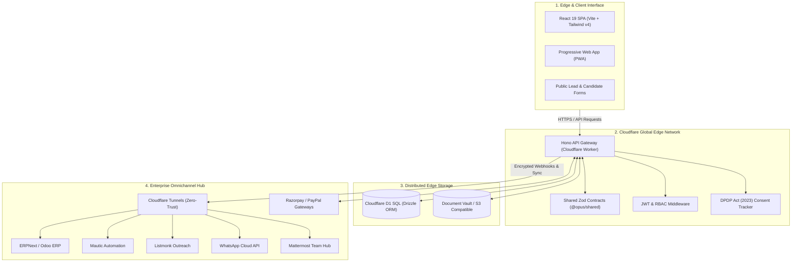

# 🌐 OpusOS — Enterprise Edge Architecture & Autonomous Operations Platform

[](https://www.typescriptlang.org/)
[](https://workers.cloudflare.com/)
[](https://hono.dev/)
[-61DAFB.svg?logo=react)](https://react.dev/)
[](https://tailwindcss.com/)
[](https://orm.drizzle.team/)
[](https://meity.gov.in/)

> **OpusOS** is a production-tested, edge-first enterprise management, CRM, and autonomous business operations platform. Built on Cloudflare Workers and D1 distributed SQL, it delivers sub-10ms global edge API performance, airtight zero-trust networking, and seamless synchronization across omnichannel communication and ERP ecosystems.

---

## 🏛️ System Architecture

OpusOS is engineered as a strictly decoupled, type-safe `pnpm` monorepo workspace conforming to the **ACE Loop Framework (v2.0)** for robust, self-correcting autonomous operations.



---

## ⚡ Key Architectural Innovations

### 1. **Sub-10ms Edge CPU Execution**
* Fully optimized Hono API running in Cloudflare V8 isolates, offloading intensive tasks to asynchronous background queues to guarantee compliance with strict 10ms CPU limits.
* Zero cold starts with instant global edge response times across 300+ edge nodes.

### 2. **Type-Safe Contract Sharing (`@opus/shared`)**
* End-to-end type safety between backend and frontend using unified **Zod schemas** and TypeScript type inference.
* Integer-based currency precision (storing monetary units in integer paise) eliminating floating-point rounding errors across invoices, deposits, and fee structures.

### 3. **DPDP Act (2023) Compliance & Zero-Trust Security**
* Built-in consent tracking, audit trails, and data isolation complying with India's Digital Personal Data Protection Act.
* Zero public IP exposure: All underlying VPS infrastructure (Mattermost, Mautic, ERPNext) is accessed exclusively via **Cloudflare Tunnels (ZTNA)**.

### 4. **The ACE Loop Framework (v2.0) Integration**
* Implements a 4-tier closed feedback execution cycle (Micro, Meso, Macro, Meta) with automated Playwright end-to-end regression suites to guarantee deterministic agentic deployments.

---

## 📂 Monorepo Structure

```text
/ (Monorepo Root)
├── apps/
│   ├── api/                     # Cloudflare Worker API (Hono + Drizzle ORM)
│   │   ├── src/
│   │   │   ├── index.ts        # Hono router entrypoint
│   │   │   ├── db.ts           # D1 SQL database client
│   │   │   ├── routes/         # Modular route groups (leads, clients, kanban, billing)
│   │   │   └── middleware/     # Auth, RBAC, audit logging, rate limiters
│   │   └── wrangler.toml       # Cloudflare deployment manifest
│   │
│   └── app/                     # Frontend Client (React 19, Vite, Tailwind CSS v4)
│       ├── src/
│       │   ├── components/     # High-fidelity UI widgets (Timeline, Vault, Kanban)
│       │   ├── pages/          # Client360, Staff Dashboard, Public Portal
│       │   └── main.tsx        # Application root
│       └── vite.config.ts
│
├── packages/
│   └── shared/                  # Common TypeScript library
│       ├── src/
│       │   ├── validation.ts   # Shared Zod runtime validators
│       │   └── types.ts        # Inferred schema types
│
├── infra/                       # Infrastructure as Code & Cloudflare configurations
├── scripts/                     # Deployment, database migration, and sync utilities
└── docs/                        # Architecture specs, audit reports, and playbooks
```

---

## 🛠️ Tech Stack & Engineering Primitives

| Component | Technology | Rationale & Advantage |
| :--- | :--- | :--- |
| **Edge Compute** | Cloudflare Workers, Hono | Ultra-fast routing, microsecond cold starts, global distribution |
| **Database** | Cloudflare D1, Drizzle ORM | Serverless SQL at the edge, lightweight migrations, type safety |
| **Frontend** | React 19, Vite, Tailwind v4 | Concurrent rendering, rapid asset compilation, mobile-first design |
| **Security** | Cloudflare Tunnels, ZTNA, JWT | Strict origin shielding, no open inbound ports, granular RBAC |
| **Validation** | Zod, TypeScript 5.x | Single source of truth for API contracts and payload validation |
| **Integrations** | ERPNext, Mautic, WhatsApp, Razorpay | End-to-end customer journey, invoicing, and messaging orchestration |
| **Testing** | Playwright, Vitest | Closed-loop automated verification, cross-browser regression testing |

---

## 🚀 Quickstart & Development

### Prerequisites
* Node.js v20+ / pnpm v9+
* Cloudflare Wrangler CLI (`npm i -g wrangler`)

### Installation
```bash
# Clone the repository
git clone https://github.com/ajmalh63/opus-os.git
cd opus-os

# Install dependencies across all monorepo packages
pnpm install

# Run database migrations locally
pnpm --filter @opus/api db:migrate:local

# Start both API and Frontend in development mode
pnpm dev
```

---

## 👨‍💻 Author & Lead Architect

**Hussain Ajmal**
* AI Systems Architect & Cybersecurity Engineer
* *M.S. in Cybersecurity (Saint Leo University, USA) | B.Tech in CS (JNTU)*
* 🔗 [LinkedIn](https://linkedin.com/in/hussainajml/)
* 🌐 [GitHub](https://github.com/ajmalh63)

---

## 📄 License
Proprietary / Commercial Architecture. All rights reserved.
