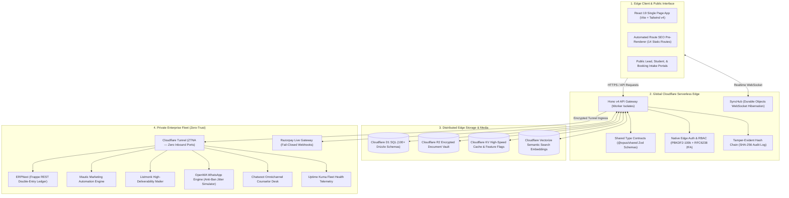

# 🌐 OpusOS — Enterprise Edge Architecture & Autonomous Operations Platform

[](https://www.typescriptlang.org/)
[](https://workers.cloudflare.com/)
[](https://hono.dev/)
[-61DAFB.svg?logo=react)](https://react.dev/)
[](https://tailwindcss.com/)
[](https://orm.drizzle.team/)
[](https://vitest.dev/)
[](https://meity.gov.in/)

> **OpusOS** is an edge-native, enterprise-grade business management and autonomous operations platform engineered for **Opus Overseas**. Running serverless across 300+ global Cloudflare edge locations, OpusOS eliminates cold starts, delivers sub-10ms isolate CPU execution, enforces a mathematically tamper-evident audit trail, and orchestrates omnichannel customer journeys, ERP workflows, and multi-division operations (Study Abroad, Tours & Travels, Attestation, and Executive Talent CRM) with zero public server exposure.

---

## 🚀 Live Production Deployments

| Component | Target URL | Architecture & Runtime |
|---|---|---|
| **Web Client (SPA)** | [opusoverseas.com](https://opusoverseas.com) / [master.opusos-app.pages.dev](https://master.opusos-app.pages.dev) | React 19 • Vite • Tailwind v4 • Cloudflare Pages |
| **Edge API Gateway** | [api.opusoverseas.com](https://api.opusoverseas.com) | Hono v4 • Cloudflare Workers • V8 Isolates • Smart Placement |
| **Edge SQL Database** | Distributed Cloudflare D1 | 100+ Tables • Drizzle ORM • Point-in-Time Recovery |
| **Realtime Sync Fabric** | WebSocket Hibernation | Cloudflare Durable Objects (`SyncHub`) |

---

## 🏛️ System Architecture

OpusOS is engineered as a strictly decoupled, type-safe monorepo workspace conforming to the **ACE Loop Framework (v2.0)** for robust, self-correcting autonomous operations.



---

## ⚡ Key Architectural Innovations & Technical Highlights

### 1. **Sub-10ms Serverless Edge Execution**
* Fully optimized **Hono v4** router executing inside Cloudflare V8 worker isolates, achieving microsecond boot times and eliminating traditional Node.js container cold starts.
* Leverages Cloudflare **Smart Placement** to automatically co-locate worker isolates in the optimal data center closest to the distributed D1 SQL database, slashing multi-roundtrip network latency.

### 2. **Integer Currency Architecture (Zero IEEE-754 Drift)**
* All currency representations, invoice balances, GST computations, and Razorpay transactions are strictly stored and computed in **integer paise** (1 INR = 100 paise).
* Completely eliminates catastrophic IEEE-754 floating-point rounding errors across complex tax structures, installment schedules, and multi-currency foreign tuition calculations.

### 3. **Tamper-Evident SHA-256 Audit Trail (v1.1)**
* Every administrative mutation, access grant, document upload, and payment verification is appended to a cryptographic hash chain:
  $$\text{record\_hash}_i = \text{SHA-256}(\text{record\_hash}_{i-1} \parallel \text{canonicalize}(\text{event}_i))$$
* Provides mathematical proof of log immutability conforming to forensic compliance standards. Verified in CI/CD via `scripts/audit-chain-verify.mjs`.

### 4. **Real-Time Sync Fabric via Durable Objects**
* Employs Cloudflare **Durable Objects** with WebSocket Hibernation (`SyncHub`) to provide instant, bidirectional synchronization across counselor desks, Kanban boards, and client portals.
* Consumes zero CPU and memory when idle while handling thousands of persistent client connections concurrently.

### 5. **Strict Zero-Trust Network Architecture (ZTNA)**
* Zero exposed inbound public ports. All backend auxiliary services (ERPNext, OpenWA, Chatwoot, Mautic, Listmonk) operate in a private cloud VPC, routed exclusively over encrypted **Cloudflare Tunnels**.
* Perimeter defense is reinforced with Cloudflare WAF as Code (`infra/terraform/cloudflare-waf.tf`), rate-limiting authentication attempts, blocking SSRF patterns, and shielding internal routes.

### 6. **DPDP Act (2023) Compliance & Privacy by Design**
* Engineered in alignment with India's Digital Personal Data Protection (DPDP) Act (2023).
* Features explicit applicant consent tracking with SHA-256 notice hashes, automated PII redaction at write boundaries, short-lived presigned document access HMACs, and complete token-masked public consultation trackers.

### 7. **Optimized Frontend Code-Splitting & Static SEO Prerender**
* Main bundle size aggressively optimized via dynamic `React.lazy()` chunking and manual vendor splitting, decreasing initial JS payload by **~360 kB** (down to 202 kB gzip).
* Automated pre-rendering engine evaluates the SPA at build time, generating static HTML snapshots with semantic OpenGraph metadata and JSON-LD schema for all public sitemap routes.

---

## 📂 Monorepo Organization

```text
/ (Monorepo Root)
├── apps/
│   ├── api/                     # Cloudflare Worker API Gateway
│   │   ├── src/
│   │   │   ├── index.ts        # Hono router entrypoint & global middleware
│   │   │   ├── db/             # D1 client & 100+ Drizzle ORM schema models
│   │   │   ├── routes/         # Modular route controllers (leads, study, umrah, auth)
│   │   │   ├── middleware/     # RBAC, audit chain, rate-limiters, CSP, CORS
│   │   │   ├── infra/          # Resilient integrations (ERPNext, WhatsApp, Listmonk)
│   │   │   └── durable/        # Durable Objects (SyncHub WebSocket fabric)
│   │   ├── migrations/         # Drizzle-generated SQL database migrations
│   │   └── wrangler.toml       # Cloudflare deployment topology manifest
│   │
│   └── app/                     # Frontend Client Application
│       ├── src/
│       │   ├── components/     # UI widgets (Kanban, Document Vault, Timeline, Fleet)
│       │   ├── pages/          # Workspaces, Client360, Public Portal, Auth Gateway
│       │   └── lib/            # Session provider, API client, sync bus
│       ├── functions/          # Cloudflare Pages Functions proxy
│       └── vite.config.ts      # Vite configuration, chunking, and Tailwind v4
│
├── packages/
│   └── shared/                  # Common TypeScript Contracts
│       └── src/
│           ├── validation.ts   # Unified Zod request/response schemas
│           └── types.ts        # Inferred TypeScript domain models
│
├── infra/                       # Infrastructure as Code (Terraform WAF, SQL queries)
├── scripts/                     # CI gates, secret guards, and audit verification tools
└── docs/                        # Specifications, security audits, and playbooks
```

---

## 🧪 Comprehensive Quality Assurance & Verification

OpusOS enforces a rigorous Machine-Verifiable Definition of Done (DoD) backed by an exhaustive test suite:

```bash
# Execute the complete Vitest test suite (122 test suites • 760 passing assertions)
pnpm test

# Verify type safety across all monorepo workspaces (apps/api, apps/app, packages/shared)
pnpm typecheck

# Validate frontend secret guard (ensures zero API keys or secrets in source or dist)
node scripts/secret-guard.mjs

# Verify the cryptographic integrity of the audit hash chain
node scripts/audit-chain-verify.mjs --self-test
```

### Verification Matrix Summary
- **Unit & Integration Tests:** 122 / 122 test files passed (100% green).
- **Total Assertions:** 760 passed, 0 failures, 0 flaky tests.
- **Static Analysis:** Clean `tsc --noEmit` across all workspaces with zero `any` coercions.
- **Production Build:** Vite production compilation completed in <3.0s with zero rollup warnings.

---

## 🔒 Security & Secret Hygiene Architecture

OpusOS strictly separates runtime configuration from secret material:
* **Zero Secrets in Source or Bundle:** The repository contains zero hardcoded API keys, passwords, or private tokens.
* **Fail-Closed Architecture:** Missing environment bindings (such as payment webhook secrets or signing keys) fail closed with explicit HTTP 500/503 responses rather than falling back to default or insecure constants.
* **Production Secret Management:** Production credentials are encrypted at rest and injected directly into Cloudflare Workers via `wrangler secret put` or the Cloudflare Secrets Store.

---

## 🛠️ Local Development Quickstart

### Prerequisites
* **Node.js** v20+
* **pnpm** v9+
* **Cloudflare Wrangler CLI** (`npm i -g wrangler`)

### Getting Started
```bash
# 1. Clone the repository
git clone https://github.com/ajmalh63/opus-os.git
cd opus-os

# 2. Install workspace dependencies
pnpm install

# 3. Apply D1 database migrations locally
npx wrangler d1 migrations apply DB --local

# 4. Start the local development API and Frontend concurrently
pnpm dev
```
* The API will run locally at `http://127.0.0.1:8787`.
* The Frontend development server will run at `http://localhost:5173`.

---

## 👨‍💻 Author & Systems Architect

**Hussain Ajmal**  
*Lead Systems Architect & Cybersecurity Engineer*  
* **M.S. in Cybersecurity** — *Saint Leo University, USA*  
* **B.Tech in Computer Science & Engineering** — *JNTUH, India*  
* 🔗 **LinkedIn:** [linkedin.com/in/hussainajml](https://linkedin.com/in/hussainajml/)  
* 🌐 **GitHub:** [github.com/ajmalh63](https://github.com/ajmalh63)

---

## 📄 License
Proprietary Architecture & Implementation. All rights reserved.
