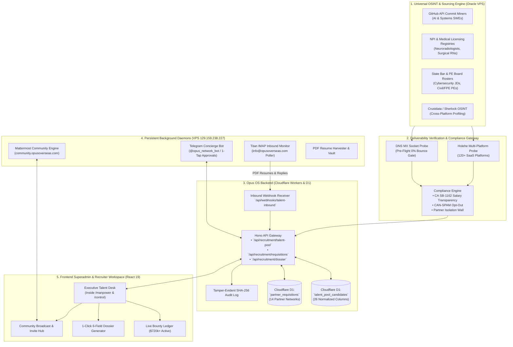

# 🏛️ Opus OS — Executive Talent CRM & Headhunting Network Integration Plan
*Document Version:* 1.0 (Master Strategic Architecture & Future Implementation Blueprint)  
*Status:* Planned / Staged for Future Implementation  
*Date:* September 3, 2026  
*Primary Operator:* Ajmal Hussain (Founder & Managing Director, Opus Overseas — `info@opusoverseas.com`)  
*Source Repository:* `/home/cordial/opus-talent-crm`  
*Target Production Environment:* Opus OS (`C:\Opus OS` / Cloudflare Workers API + D1 + React 19 SPA)

---

## 🗺️ 1. Executive Summary & Strategic Objective

This document defines the complete end-to-end blueprint for integrating the **Opus Overseas Autonomous Talent Acquisition Engine & Executive Headhunting Network** into the core **Opus OS** platform.

### Core Value Proposition:
1. **High-Bounty Executive Recruiting ($10k–$50k / Placement):** Extends Opus OS from traditional overseas manpower deployment (blue/pink-collar) into elite white-collar headhunting across AI/Robotics, Medical/Healthcare, Licensed PE Engineering, and Construction Management.
2. **Active Pipeline Value ($720,400+ USD):** Ingests and manages 48+ verified executive candidate profiles and active requisitions across 14 top-tier partner recruiter networks.
3. **Zero-CAC Partner Marketplace Expansion:** Systematically taps into **14 split-fee marketplaces** (IronBase, Refery, Paraform, BountyJobs, Reflik, Scout Exchange, Wellfound, Top Echelon, Arc.dev, etc.) using automated requisition prefixing (`IB-`, `REF-`, `PAR-`, `BTY-`).
4. **Autonomous Infrastructure Integration:** Connects the live **Opus Executive Network** (`community.opusoverseas.com` on Mattermost), Telegram Concierge Bot (`@opus_network_bot`), 0-bounce deliverability engines (Holehe, DNS MX Probes), and Titan SMTPS/IMAP synchronization into Opus OS's Cloudflare D1 and React 19 architecture.

---

## 🏗️ 2. Master System Topology



---

## 🗄️ 3. Database Schema Specifications (Drizzle ORM for Cloudflare D1)

The following tables will be integrated into [`apps/api/src/db/schema.ts`](file:///media/cordial/New%20Volume/Opus%20OS/apps/api/src/db/schema.ts):

### A. `talent_pool_candidates` (Master Candidate Registry)
```typescript
export const talentPoolCandidates = sqliteTable('talent_pool_candidates', {
  id: text('id').primaryKey().$defaultFn(() => crypto.randomUUID()),
  candidateCode: text('candidate_code').notNull().unique(), // CAND-001 to CAND-048
  fullName: text('full_name').notNull(),
  primaryEmail: text('primary_email').notNull(),            // Personal mailbox (@gmail, @yahoo)
  secondaryEmails: text('secondary_emails'),                // JSON array of permutated personal mailboxes
  targetRole: text('target_role').notNull(),                // e.g. Founding AI/VLM Engineer
  targetPractice: text('target_practice').notNull(),        // ai_systems, healthcare, engineering_pe, construction_pm, cybersecurity_jd
  clientName: text('client_name').notNull(),                // Anonymized or Real Client Name
  currentCompany: text('current_company'),
  location: text('location'),
  workAuthStatus: text('work_auth_status').notNull(),       // usc_gc, h1b_transfer, tn_visa, ead
  submissionPlatform: text('submission_platform').notNull(),// refery, ironbase, paraform, bountyjobs, direct
  platformCode: text('platform_code'),                      // REF-ALC-01, IB-APG-01, etc.
  platformFeeSplit: text('platform_fee_split'),             // Direct 80%, Split 50%, Direct 100%
  estimatedBountyUsd: integer('estimated_bounty_usd'),      // Placement fee in integer USD ($4,000 to $50,000)
  guaranteePeriodDays: integer('guarantee_period_days').default(90),
  outreachStatus: text('outreach_status').notNull().default('queued'), // queued, delivered, replied, suppressed
  applicationStatus: text('application_status').notNull().default('active'), // active, screening, submitted, interviewing, placed, archived
  sourcePlatform: text('source_platform'),                  // github_api, npi_registry, state_bar, sfpe_roster
  sourceUrl: text('source_url'),
  verificationTool: text('verification_tool'),              // holehe, dns_mx_socket
  deliverabilityGrade: text('deliverability_grade').default('grade_a'), // grade_a, grade_b, unverified, bounced
  fitScore: integer('fit_score').default(95),               // 0 to 100%
  linkedinUrl: text('linkedin_url'),                        // Verified live LinkedIn member URL
  resumePath: text('resume_path'),                          // R2 / local vault path to PDF resume
  sentFolderVerified: integer('sent_folder_verified', { mode: 'boolean' }).default(true),
  complianceSb1162Disclosed: integer('compliance_sb1162_disclosed', { mode: 'boolean' }).default(true),
  complianceCanSpamOptOut: integer('compliance_can_spam_opt_out', { mode: 'boolean' }).default(true),
  complianceNdaBlindClient: integer('compliance_nda_blind_client', { mode: 'boolean' }).default(true),
  notes: text('notes'),
  createdAt: integer('created_at', { mode: 'timestamp' }).notNull().$defaultFn(() => new Date()),
  updatedAt: integer('updated_at', { mode: 'timestamp' }).notNull().$defaultFn(() => new Date()),
});
```

### B. `partner_requisitions` (Requisition Directory & Bounties)
```typescript
export const partnerRequisitions = sqliteTable('partner_requisitions', {
  id: text('id').primaryKey().$defaultFn(() => crypto.randomUUID()),
  requisitionId: text('requisition_id').notNull().unique(), // REF-ALC-01, IB-APG-01, PAR-ARX-01
  partnerPlatform: text('partner_platform').notNull(),      // refery, ironbase, paraform, bountyjobs, direct
  platformPrefix: text('platform_prefix').notNull(),        // REF-, IB-, PAR-, BTY-, DIR-
  jobTitle: text('job_title').notNull(),
  targetDivision: text('target_division').notNull(),        // tech, engineering, healthcare, construction, finance
  mattermostChannel: text('mattermost_channel').notNull(),  // #tech, #engineering, #healthcare, #construction
  anonymizedClientDescription: text('anonymized_client_description').notNull(),
  realClientName: text('real_client_name').notNull(),       // Superadmin Only (Confidential)
  location: text('location').notNull(),
  employmentType: text('employment_type').notNull(),        // full_time, 1099_contract
  workAuthRequired: text('work_auth_required').notNull(),   // usc_gc, visa_sponsorship_eligible
  baseSalaryMinUsd: integer('base_salary_min_usd'),
  baseSalaryMaxUsd: integer('base_salary_max_usd'),
  equityCompensation: text('equity_compensation'),          // e.g. 0.5% - 2.0%
  estimatedBountyUsd: integer('estimated_bounty_usd').notNull(),
  feeSplitPercentage: integer('fee_split_percentage').default(80), // 80%, 50%, 100%
  guaranteeDays: integer('guarantee_days').default(90),
  louAdlerPerformanceSpec: text('lou_adler_performance_spec'), // Outcome-based milestones
  submissionInstructions: text('submission_instructions'),  // Email lily@refery.io / Submit on IronBase
  status: text('status').notNull().default('active'),        // active, paused, filled, closed
  createdAt: integer('created_at', { mode: 'timestamp' }).notNull().$defaultFn(() => new Date()),
  updatedAt: integer('updated_at', { mode: 'timestamp' }).notNull().$defaultFn(() => new Date()),
});
```

### C. `recruitment_submissions` (Submittal & Escrow Lifecycle)
```typescript
export const recruitmentSubmissions = sqliteTable('recruitment_submissions', {
  id: text('id').primaryKey().$defaultFn(() => crypto.randomUUID()),
  candidateId: text('candidate_id').notNull().references(() => talentPoolCandidates.id),
  requisitionId: text('requisition_id').notNull().references(() => partnerRequisitions.id),
  dossierPayloadJson: text('dossier_payload_json').notNull(), // Formatted 6-Field Dossier
  submissionStatus: text('submission_status').notNull().default('submitted'), // submitted, client_review, interview_scheduled, offer_extended, placed, rejected
  interviewDate: integer('interview_date', { mode: 'timestamp' }),
  offerAcceptedDate: integer('offer_accepted_date', { mode: 'timestamp' }),
  placementBountyUsd: integer('placement_bounty_usd'),
  escrowUnlockDate: integer('escrow_unlock_date', { mode: 'timestamp' }), // +90 days post-start
  payoutStatus: text('payout_status').default('pending_guarantee'), // pending_guarantee, unlocked, received, archived
  notes: text('notes'),
  createdAt: integer('created_at', { mode: 'timestamp' }).notNull().$defaultFn(() => new Date()),
  updatedAt: integer('updated_at', { mode: 'timestamp' }).notNull().$defaultFn(() => new Date()),
});
```

---

## ⚡ 4. Backend API Module Specifications (`apps/api/src/routes/talentPool.ts`)

### Endpoints to Implement:

| Method | Endpoint | Access | Purpose |
| :--- | :--- | :---: | :--- |
| `GET` | `/api/recruitment/talent-pool` | Staff / Admin | Query candidates with filters for practice, deliverability grade, work authorization, and fit score. |
| `POST` | `/api/recruitment/talent-pool` | Staff / Admin | Ingest new candidate profiles (supports manual intake and bulk OSINT imports). |
| `PATCH` | `/api/recruitment/talent-pool/:id/stage` | Staff / Admin | Advance candidate stage (`sourced` $\rightarrow$ `delivered` $\rightarrow$ `replied` $\rightarrow$ `submitted` $\rightarrow$ `placed`). |
| `GET` | `/api/recruitment/requisitions` | Staff / Admin | Browse active requisitions with prefix isolation (`REF-`, `IB-`, `PAR-`). |
| `POST` | `/api/recruitment/requisitions` | Admin Only | Create new requisitions with Lou Adler performance profiles and bounty structures. |
| `POST` | `/api/recruitment/dossier/generate` | Staff / Admin | Instantly compiles the standardized **6-Field Candidate Dossier** for 1-click partner submission. |
| `POST` | `/api/webhooks/talent-inbound` | Webhook Secret | Receives inbound candidate replies and PDF resumes from VPS IMAP monitor, auto-updating records. |
| `GET` | `/api/recruitment/pipeline-analytics` | Admin Only | Aggregated live metrics: Total bounty pipeline value ($720k+), submittals, interview conversion rates. |

### The Standardized 6-Field Dossier Generator Algorithm:
```typescript
export function generateCandidateDossier(candidate: TalentCandidate, requisition: PartnerRequisition): string {
  return `
=== OPUS OVERSEAS — 6-FIELD CANDIDATE DOSSIER ===
1. Candidate Name: ${candidate.fullName}
2. Target Requisition: ${requisition.requisitionId} — ${requisition.jobTitle}
3. Current Employer & Location: ${candidate.currentCompany || 'Confidential'} · ${candidate.location}
4. Verified Work Authorization: ${candidate.workAuthStatus.toUpperCase()} (US Citizen / Permanent Resident)
5. Core Outcome Qualifications:
   • Fit Score: ${candidate.fitScore}% Match for ${requisition.jobTitle}
   • Proven Background: ${candidate.notes || 'Verified specialist across targeted technical domain.'}
   • Deliverability Status: Grade A Verified Personal Inbox (${candidate.primaryEmail})
6. Verification & Profile Assets:
   • Live LinkedIn: ${candidate.linkedinUrl}
   • Resume Attachment: Available in Opus Talent Vault (Ref: ${candidate.candidateCode})
=================================================
`.trim();
}
```

---

## 💻 5. Frontend UI/UX Specifications (`apps/app`)

### A. Executive Headhunting Desk (`ManpowerPortal.tsx`)
Within [`apps/app/src/pages/divisions/ManpowerPortal.tsx`](file:///media/cordial/New%20Volume/Opus%20OS/apps/app/src/pages/divisions/ManpowerPortal.tsx), an **"Executive Search & Talent Pool"** tab will render:

1. **Pipeline Value Header Strip:**
   * **Total Pipeline Value:** `$720,400 USD`
   * **Active Sourced Candidates:** `48`
   * **Deliverability Integrity:** `100% Grade A (0% Bounce)`
   * **Active Partner Requisitions:** `14 Reqs across 5 Practice Groups`
2. **Interactive Candidate Pipeline Table:**
   * Filter by Practice Group: `AI & Systems`, `Medical / Healthcare`, `PE Engineering`, `Construction PM`, `Cybersecurity JD`.
   * Search by Candidate Code (`CAND-001`), Name, Skillset, or Location.
   * Visual Status Pills: `✅ Grade A Verified`, `Delivered & Synced`, `Replied`, `Interviewing`.
   * Actions: **1-Click Generate Dossier**, **Launch LinkedIn**, **View PDF Resume**, **Advance Stage**.
3. **Partner Requisitions Hub:**
   * Displays all open mandates tagged by Requisition Prefix (`REF-ARX-01`, `IB-APG-01`).
   * Displays Fee Split, Guarantee Period (90 Days), and Estimated Bounty ($10k–$50k).
   * **Match Candidates Button:** Automatically ranks top-fitting candidates in the talent pool using cosine similarity on skills and experience.
4. **Community Syndication Widget:**
   * Displays live status of `community.opusoverseas.com` (Mattermost Team Engine).
   * 1-Click invite link generator for candidates and peer recruiters.

### B. Candidate & Public Website Enhancements:
1. **Stealth Search Guarantee Banner:**
   * Featured on `/manpower` and `/careers`: Assures candidates that employed profiles are 100% blind and never shared without prior approval.
2. **Direct Employer Intake Form (`/manpower/hire`):**
   * Allows US companies to submit requisitions directly with outcome-based specs.
   * Renders an interactive **Blind Candidate Showcase** allowing employers to request interviews with top-tier talent.

---

## 🤖 6. Persistent VPS Infrastructure & Background Daemons (`129.159.238.227`)

The Oracle Cloud VPS will execute persistent background jobs and communicate with Opus OS via HTTPS APIs and Webhooks:

```
┌────────────────────────────────────────────────────────────────────────────────────────┐
│                          ORACLE CLOUD VPS (129.159.238.227)                            │
├────────────────────────────────────────────────────────────────────────────────────────┤
│ 1. Mattermost Team Engine:                                                             │
│    • Host: Docker Container `mattermost-app` (v11.10.1) on Port 8065                   │
│    • Edge Domain: `https://community.opusoverseas.com` (Cloudflare Tunnel)             │
│    • PostgreSQL 16 Alpine Database: `mattermost-db`                                    │
│                                                                                        │
│ 2. Telegram Gatekeeper Daemon (`opus-gatekeeper.service`):                             │
│    • Script: `/home/ubuntu/services/mattermost/opus_gatekeeper.py`                     │
│    • Telegram Bot: `@opus_network_bot` (Admin ID: `1008734204`)                       │
│    • Superpower: 1-Tap Mobile Approvals, Risk Scoring, Auto-Unlock on `#introductions` │
│                                                                                        │
│ 3. Autonomous Inbound Harvester (`InboundMonitor`):                                    │
│    • Connects to Titan Webmail IMAP SSL (`imap.secureserver.net:993`)                  │
│    • Polls candidate replies and downloads PDF resumes to `/resumes/` every 15 min.    │
│    • Calls Opus OS Webhook (`POST /api/webhooks/talent-inbound`) on new activity.      │
│                                                                                        │
│ 4. OSINT Mining Tools (/media/cordial/New Volume1/recruiting_tools/):                  │
│    • Holehe v1.61 (120+ Platform Probe)                                                │
│    • Sherlock v0.16.1 (400+ Social Networks)                                           │
│    • theHarvester v4.9.2 (Domain & MX Footprinting)                                    │
│    • n8n Workflow Automation Engine (Port 5678)                                        │
└────────────────────────────────────────────────────────────────────────────────────────┘
```

---

## 🔒 7. Compliance, Security & Partner Isolation Invariants

1. **Upstream Partner Isolation Wall:**
   * Platform names (`Refery`, `IronBase`, `Paraform`, `BountyJobs`) and fee splits (70/30, 80/20) are strictly restricted to Superadmin (`owner@opusoverseas.com`). Candidates and public users only see the **Opus Overseas Executive Search** brand.
2. **Statutory Salary Transparency (CA SB-1162 / Multi-State Compliance):**
   * All job postings and candidate communications must include explicit base salary bands (e.g. `$180,000 – $245,000 USD`) and work authorization criteria (`US Citizen / Permanent Resident`).
3. **Tamper-Evident Audit Chain:**
   * Every candidate creation, email dispatch, submittal generation, and status change is automatically written to Opus OS's append-only SHA-256 hash-chained `audit_log` with actor identity and timestamp.

---

## 📋 8. Future Implementation Checklist (When Ready to Build)

- [ ] **Step 1: Database Migration (Cloudflare D1)**
  - Add `talent_pool_candidates`, `partner_requisitions`, and `recruitment_submissions` to `schema.ts`.
  - Generate Drizzle migration SQL and apply locally and to Cloudflare D1.
  - Seed the 48 active candidate profiles and 14 partner requisitions from `master_compliance_talent_pipeline.json`.
- [ ] **Step 2: Backend API Module**
  - Implement `apps/api/src/routes/talentPool.ts` and wire into `apps/api/src/index.ts`.
  - Implement the 6-field candidate dossier generator and inbound webhook receiver.
  - Add unit tests in `apps/api/tests/talentPool.test.ts`.
- [ ] **Step 3: Frontend Executive Desk**
  - Add the **Executive Search & Talent Pool** tab to `ManpowerPortal.tsx`.
  - Build the Live Pipeline Ledger, Candidate Roster, Dossier Modal, and Requisition Directory.
  - Add "Executive Network" community invite links to website navigation and footer.
- [ ] **Step 4: VPS Daemon & Webhook Wiring**
  - Configure `opus_recruiting_engine.py` on VPS to dispatch webhook events to `https://api.opusoverseas.com/api/webhooks/talent-inbound`.
  - Verify 1-tap Telegram approval bot synchronization.
- [ ] **Step 5: End-to-End Verification**
  - Run full test suite (`pnpm test`) across all 122+ test files.
  - Deploy Worker API and Pages SPA to Cloudflare production.

---

*This master planning document is permanently preserved in `/docs/OPUS-EXECUTIVE-TALENT-CRM-INTEGRATION-PLAN.md` for future execution.*
