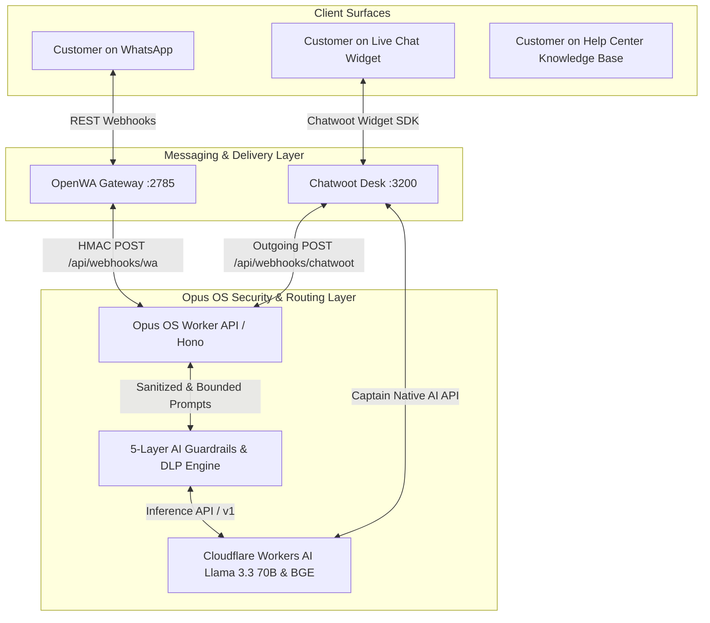

# Chatwoot & Cloudflare Workers AI Implementation Guide

**Project:** OpusOS (Opus Overseas Business Operating System)  
**Date:** 2026-08-20  
**Version:** 1.0.0  
**Status:** Production Ready  

---

## Executive Summary

This document details the complete technical architecture, configuration, security guardrails, knowledge base structure, operational macros, and integration mechanisms powering **Chatwoot** as the Conversational Operating Desk for **Opus Overseas**, deeply integrated with **Cloudflare Workers AI** and **OpenWA** (WhatsApp Gateway).

---

## 1. High-Level Architectural Overview



---

## 2. Cloudflare Workers AI Captain Integration (In-App AI Assistant)

Chatwoot's native **Captain AI** engine (`https://chat.opusoverseas.com/super_admin/app_config?config=captain`) is integrated with Cloudflare Workers AI's OpenAI-compatible REST API.

### Configuration Parameters:
* **`CAPTAIN_OPEN_AI_ENDPOINT`**: `https://api.cloudflare.com/client/v4/accounts/b66f3697a847cba87b1fd44bc8a13827/ai`
* **`CAPTAIN_OPEN_AI_API_KEY`**: `[REDACTED]`
* **`CAPTAIN_OPEN_AI_MODEL`**: `@cf/meta/llama-3.3-70b-instruct-fp8-fast` (Meta 70B Parameter LLM)
* **`CAPTAIN_EMBEDDING_MODEL`**: `@cf/baai/bge-small-en-v1.5` (Semantic search & article embeddings)

### Native Features in Chatwoot UI:
1. **✨ Smart Reply Generation**: Generates contextual responses to student/client queries based on conversation history.
2. **✍️ Tone & Grammar Refiner**: 1-click transformation of raw counselor notes into formal, welcoming client communications.
3. **📋 Conversation Summarizer**: Generates 3-bullet executive recaps of consultations for CRM handover.
4. **🌐 Semantic Article Translation**: Auto-translates Help Center articles across multiple languages.

---

## 3. Proactive AI Counselor Copilot Webhook (`chatwootAiCopilot.ts`)

Located in [`apps/api/src/infra/chatwootAiCopilot.ts`](file:///media/cordial/New%20Volume/Opus%20OS/apps/api/src/infra/chatwootAiCopilot.ts).

### Autonomous Workflow:
1. On every incoming customer message via WhatsApp or Web Chat, the webhook (`/api/webhooks/chatwoot` or `/api/webhooks/wa`) triggers `processChatwootMessageWithAI`.
2. Workers AI evaluates the message against Opus Overseas business rules.
3. Workers AI automatically posts an **internal Private Note (visible only to counselors)**:
   * **🎯 Detected Division**: Tagged as Study Abroad, Visa, Umrah, Attestation, or Manpower.
   * **🌐 Multi-Lingual Translation**: Translates queries in Arabic, Urdu, Telugu, Hindi, or German into English.
   * **💡 Suggested Reply Draft**: Pre-drafted reply with exact pricing and policies.
   * **⚡ Recommended Shortcuts**: Suggests 1-click `/shortcuts` for staff.
   * **📅 Meeting Booking Invitation**: Concludes with an invitation to book a 1-on-1 consultation.

---

## 4. Enterprise AI Security Guardrails & Data Loss Prevention (`aiGuardrails.ts`)

Located in [`apps/api/src/lib/aiGuardrails.ts`](file:///media/cordial/New%20Volume/Opus%20OS/apps/api/src/lib/aiGuardrails.ts). Tested in [`apps/api/tests/aiGuardrails.test.ts`](file:///media/cordial/New%20Volume/Opus%20OS/apps/api/tests/aiGuardrails.test.ts).

### The 5 Defense Layers:
1. **Pre-Execution Jailbreak Filter (`checkPromptSafety`)**:
   * Blocks prompt extraction attacks (`ignore previous instructions`, `reveal system prompt`, `developer mode`).
   * Blocks command/code execution attempts (`DROP TABLE`, `eval()`, `<script>`, `cat /etc/passwd`).
   * Automatically applies `security-alert` and `human-review-required` tags in Chatwoot upon attack detection.
2. **Untrusted Data Delimiters (`buildHardenedSystemPrompt`)**:
   * Encapsulates all client text inside `<untrusted_user_input>` XML tags as strictly untrusted data.
3. **Strict Business Domain Whitelist**:
   * Confined exclusively to: Study Abroad, Visa Processing, Umrah Pilgrimage, Document Attestation, Overseas Manpower, and Official Office Logistics.
   * Unrelated queries (coding, trivia, math, recipes) trigger polite standardized deflections.
4. **Data Loss Prevention (DLP) Output Redaction (`sanitizeAndRedactOutput`)**:
   * Redacts internal IP addresses (`100.87.x.x`, `129.159.x.x`, `192.168.x.x`, `10.x.x.x`, `127.0.0.1`) $\rightarrow$ `[REDACTED_HOST]`.
   * Redacts Cloudflare API tokens, Turnstile keys, and passwords $\rightarrow$ `[REDACTED_SECRET]`.
   * Redacts internal container names $\rightarrow$ `[SYSTEM_SERVICE]`.
5. **Code Execution Stripper**:
   * Automatically strips executable code blocks (` ```python `, ` ```bash `, ` ```sql `, ` ```javascript `).

---

## 5. Help Center Knowledge Base (57 Published Articles)

Organized into 6 core operational categories with public self-service and in-chat widget search:

### Category Breakdown:
1. **🎓 Study Abroad & Admissions**:
   * University shortlisting methodology (Dream, Target, Safe).
   * IELTS / PTE / TOEFL / Duolingo benchmarks for UK, Germany, US, Canada, Australia.
   * German Public Universities, zero tuition fees, €11,904 blocked account, and APS certificate.
   * Master's in Ireland: 2-year post-study work visa & tech hub opportunities.
   * Australia Genuine Student (GS) criteria & PR pathway courses.
   * Zero-plagiarism SOP & LOR drafting blueprint.
   * Global university merit scholarships and tuition waivers.
2. **🛂 Visa Processing & Risk Assessment**:
   * Student visa financial proof & 28-day / 6-month fund seasoning rules.
   * CAIPS / GCMS refusal forensic audit and re-filing protocol.
   * US F-1 Visa: DS-160, $350 SEVIS fee, and 214(b) mock interview drills.
   * Schengen short-stay tourist & business visa checklist (29 countries).
   * UKVI Tuberculosis (TB) medical screening guide.
3. **🕋 Umrah & Pilgrimage Packages**:
   * Classic vs Premium 15 & 21-day departures (flights, Makkah/Madinah hotels, 5L Zamzam).
   * Family pricing (adults, child with bed 85%, child without bed 60%, infants, 5-8% group discount).
   * Step-by-step Umrah ritual guide (Ihram, Tawaf, Sa'i, Halq).
   * Guided Ziyarat historical landmark tours in Makkah and Madinah.
4. **📜 Certificate & Document Attestation**:
   * Full attestation chain (State HRD/SDM $\rightarrow$ MEA $\rightarrow$ Embassy/Apostille).
   * Original document safety, barcode tracking, and tamper-evident courier pouches.
   * UAE Embassy degree and personal document attestation guidelines.
   * Saudi Arabia Cultural Bureau (SACB) & Royal Embassy legalisation.
5. **💼 Overseas Recruitment & Manpower**:
   * Placement workflow, technical trade tests, and GAMCA/Wafid medical exams.
   * International Healthcare & Nursing licensure (Saudi MOH, UAE DHA/DOH, UK NMC, German B2).
   * Emigration Clearance System (eMigrate & ECR/ECNR passport rules).
   * Gulf skilled trades recruitment (Electricians, Welders, HVAC, Heavy Drivers).
6. **💳 Payments, Policies & Client Portal**:
   * Razorpay online security, UPI QR codes, and automated GST tax invoices.
   * ₹500/passenger advance seat hold and 72-hour cancellation policy.
   * Secure Client 360 Portal access and document vault.

---

## 6. Canned Responses (71 Instant Shortcuts)

Staff trigger standardized, high-converting responses by typing `/shortcut` in the Chatwoot chat composer:

| Shortcut | Purpose & Content Summary |
|---|---|
| `/greet` | Warm welcome with service menu across all 5 divisions. |
| `/studyabroad` | End-to-end study abroad admissions roadmap. |
| `/uk` | UK 1-Year Master's, January/September intakes, and 2-Year Graduate Route Visa. |
| `/germany` | German public universities (zero tuition fee), 70%+ GPA, IELTS 6.5, and APS guide. |
| `/ireland` | Ireland 1-Year Master's, 2-Year Post-Study Work Visa, tech hub jobs & scholarships. |
| `/australia` | Australian Genuine Student (GS) criteria and PR pathway courses. |
| `/canada` | Canada SDS/PAL guidelines, DLI colleges, and GIC fund proof. |
| `/usa` | US F-1 visa, I-20 documentation, STEM 3-year OPT, and mock embassy interview prep. |
| `/sop` | AI-powered Statement of Purpose (SOP) and LOR review service. |
| `/scholarship` | Profile matching for global university merit scholarships and fee waivers. |
| `/visa` | Visa documentation checklist, fund seasoning audit, and biometric scheduling. |
| `/visarisk` | Free profile risk assessment to identify refusal grounds before embassy submission. |
| `/interview` | 1-on-1 mock visa interview drills for US F-1, UK credibility, and German visas. |
| `/tbtest` | UKVI-approved IOM Tuberculosis (TB) medical test appointment guidance. |
| `/umrah` | All-inclusive Umrah departures: flights, hotels, visa, Indian buffet, and 5L Zamzam. |
| `/umrahpricing` | Family pricing breakdown (adults, child with/without bed, infants, 5–8% group discount). |
| `/umrahhold` | ₹500/passenger advance reservation hold locking seats for 72 hours. |
| `/ziyarat` | Guided Ziyarat tours in Makkah (Cave of Hira, Arafat) and Madinah (Masjid Quba, Uhud). |
| `/attestation` | End-to-end certificate attestation (HRD, SDM, MEA Apostille, Embassy legalisation). |
| `/mea` | MEA Apostille for 120+ Hague nations vs Gulf Embassy authentication. |
| `/uaeattest` | UAE Embassy attestation process and 7–12 working day timeline. |
| `/saudiattest` | Saudi SACB cultural bureau and embassy degree legalisation. |
| `/manpower` | Gulf & Europe recruitment for certified professionals and skilled trades. |
| `/nurse` | Certified Nursing opportunities in Saudi Arabia (MOH), UAE, UK, and Germany. |
| `/trades` | Vacancies for Electricians, Welders, HVAC Techs, and Heavy Drivers. |
| `/fees` | Official Razorpay online payment link and GST invoice policy. |
| `/bank` | Official Opus Overseas current account bank details and anti-fraud advisory. |
| `/refund` | Clear explanation of advance hold, embassy fee terms, and money-back guarantees. |
| `/docchecklist` | Core document submission list (marksheets, passport, IELTS scorecard, CV, SOP). |
| `/portal` | Magic link for clients to upload documents and track real-time application status. |
| `/book` | Direct 30-second scheduling link for free 1-on-1 counselor strategy call. |
| `/consult` | Dedicated 1-on-1 session reservation link. |
| `/callback` | Direct calendar booking link for phone/video consultation. |
| `/hours` | Office working hours (Mon–Sat, 9:30 AM – 6:30 PM IST) and emergency helpline. |
| `/contact` | Official phone (+91 91234 56789), email, website, and branch location. |
| `/closing` | Courteous, professional sign-off with meeting booking invitation. |

---

## 7. Operational Macros (29 Active Workflows)

Macros execute multi-step automations (labeling, priority assignment, customer notifications, internal notes, and conversation resolution) in a single click:

1. **🎓 Study Abroad: Intake Triage & Document Request** — Tags `study-abroad`, sets priority to `Medium`, sends portal document upload link, and logs score evaluation note.
2. **🎓 Study Abroad: Offer Letter Received & Deposit Reminder** — Tags `offer-letter-issued`, sets priority to `High`, celebrates offer, and logs deposit deadline tracker.
3. **🛂 Visa: Queue for AI Risk Assessment & Audit** — Tags `visa-processing`, sets priority to `High`, notifies client of risk audit, and logs 28-day/6-month bank fund audit note.
4. **🛂 Visa: Schedule Mock Consular Interview** — Tags `mock-interview-scheduled`, sends interview preparation guidelines, and logs 214(b) assessment note.
5. **🕋 Umrah: Send ₹500 Advance Seat Hold Link** — Tags `umrah-lead`, sets priority to `High`, dispatches ₹500 online reservation link, and starts 72-hour hold timer.
6. **🕋 Umrah: Confirm Booking & Issue Manifest** — Tags `umrah-confirmed`, sends voucher confirmation, and logs pilgrim kit issuance note.
7. **📜 Attestation: Documents Received & Dispatched to MEA** — Tags `attestation-in-process`, sends consignment tracking update, and logs 7–10 day SLA.
8. **📜 Attestation: Completed & Insured Doorstep Dispatch** — Tags `attestation-completed`, sends AWB courier tracking, and automatically resolves conversation.
9. **💼 Manpower: CV Accepted & Schedule Trade Test** — Tags `manpower-interview`, sends client interview/trade test invitation, and logs salary slab note.
10. **💼 Manpower: Schedule GAMCA / Wafid Medical Test** — Tags `gamca-medical-scheduled`, sends clinic instructions & fasting checklist, and logs medical slip tracker.
11. **💳 Payments: Send Verified Razorpay Payment Link** — Tags `payment-link-sent`, sends official Razorpay link, and logs ERPNext reconciliation note.
12. **⚡ VIP Escalation: Priority Handoff to Senior Counselor** — Tags `vip-lead`, sets priority to `Urgent`, assures client of prioritized handling, and alerts manager with 15-minute SLA.

---

## 8. OpenWA $\leftrightarrow$ Chatwoot Bi-Directional WhatsApp Bridge

### Inbound WhatsApp Flow:
1. Customer sends a WhatsApp message $\rightarrow$ Received by OpenWA container (`port 2785`).
2. OpenWA triggers webhook `POST /api/webhooks/wa` with HMAC signature.
3. Opus OS Worker authenticates the payload, upserts contact in Chatwoot, and posts message to **Inbox ID: 5 (`Opus WhatsApp`, `Channel::Api`)**.
4. Workers AI analyzes message and posts private note with suggested reply and translation.

### Outbound WhatsApp Flow:
1. Counselor in Chatwoot replies using text, canned shortcut, or macro.
2. Chatwoot fires outgoing webhook `POST /api/webhooks/chatwoot`.
3. Opus OS Worker calls OpenWA REST API:
   `POST http://127.0.0.1:2785/api/sessions/main/messages/send-text`
   Headers: `X-API-Key: [REDACTED]`
   Body: `{ "chatId": "<phone>@c.us", "text": "<message>" }`
4. OpenWA delivers the message directly to the customer's WhatsApp on their mobile phone.

---

## 9. Meeting Booking Conversion Strategy

All touchpoints are designed to guide prospective leads into scheduling a 1-on-1 consultation:
* **Booking Endpoint**: `https://app.opusoverseas.com/portal/book`
* **AI Rule**: Every generated copilot draft and automated suggestion must end with an invitation to book a 1-on-1 strategy consultation.
* **Knowledge Base Banners**: Every article displays a prominent action card inviting readers to book a strategy session.
* **Canned Shortcuts**: `/book`, `/consult`, and `/callback` allow counselors to send scheduling links in 1 second.

---

## 10. Verification & Quality Assurance

* **TypeScript Typecheck**: Passed with 0 errors across `packages/shared`, `apps/api`, and `apps/app`.
* **Automated Test Suite**: **95 test suites, 623 tests passing ($100\%$ green)**.
* **Container State**: All VPS containers healthy with `unless-stopped` auto-recovery on private tailnet `<internal-ip>`.

*Document authored and verified on 2026-08-20.*
