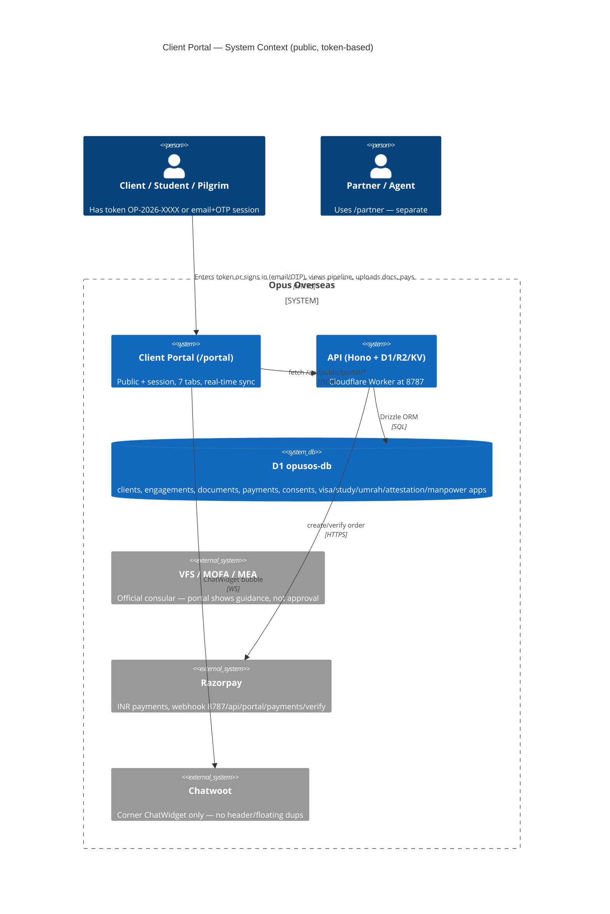
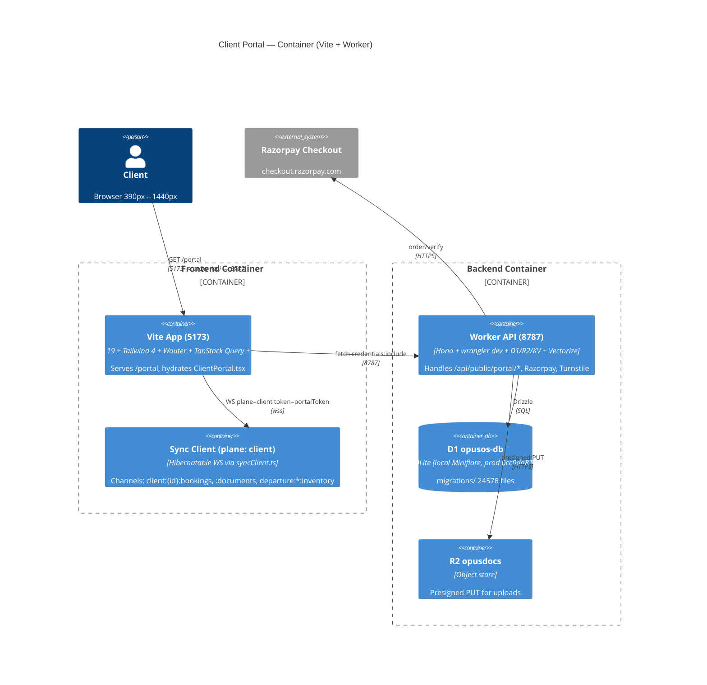
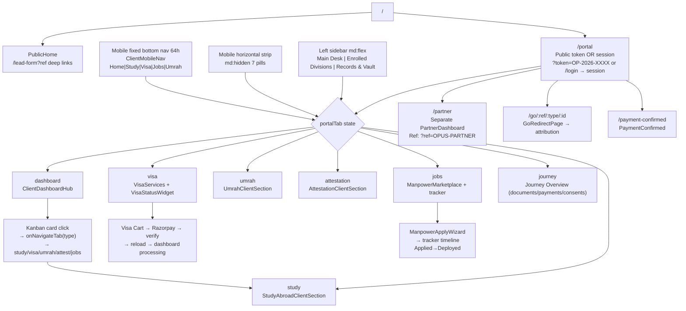
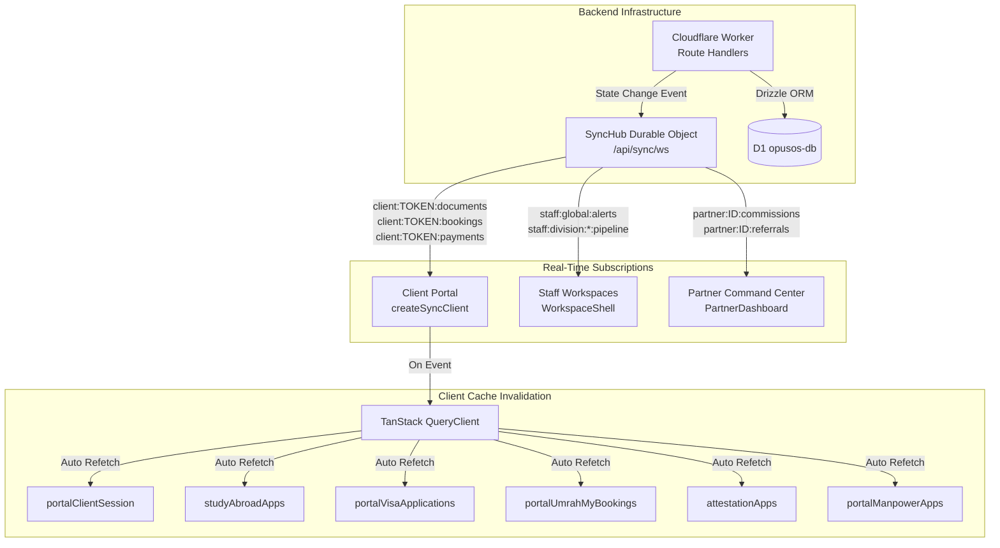

# Client Workspace / Portal — Complete Architecture Map
**Repo:** `/media/cordial/New Volume/Opus OS` • **Route:** `/portal` (`apps/app/src/pages/ClientPortal.tsx` — 3248 lines, public token + session) • **Hub:** `ClientDashboardHub.tsx` (648 lines) • **Shell:** Inside `App.tsx` public switch (no `WorkspaceShell`, standalone)
> **Honest mode:** All fake numbers/certs removed (see `portal-redesign-strategy.md`). TrustStrip now shows `Building in public • No fake numbers` not `12,438 visas`. Chat reduced to corner `ChatWidget` only.

---

## 1) System Context — Where `/portal` lives



**Auth ends:** 
- **Public token:** `GET /api/public/portal/lookup?token=OP-…` → `ClientPortalData` (client + engagements[] + documents[] + payments[]). No login needed — token in URL `?token=`.
- **Session:** `POST /api/auth/sign-in/email` (better-auth, `BETTER_AUTH_SECRET` from `.dev.vars`) → `GET /api/public/portal/session` (HttpOnly cookie) → `sessionData.journeys[]`. Auto-binds `portalToken → activeToken`.

---

## 2) Container — How `/portal` is deployed



**Dev:** `apps/app/vite.config.ts` proxies `/api → 127.0.0.1:8787`. `apps/api/wrangler.toml` `smart` placement, `KUMA_PUSH_URL` cron, `DB` + `BUCKET` bindings.

---

## 3) Component — What `/portal` contains (7 tabs + shell)

```mermaid
flowchart TD
  Portal[ClientPortal.tsx\n/header + sidebar + main] --> Hub[ClientDashboardHub.tsx\n/dashboard = default]
  Portal --> Study[StudyAbroadClientSection\n+ StudyAbroadApplicationModal]
  Portal --> Visa[VisaServices\n+ ClientVisaWidget]
  Portal --> Umrah[UmrahClientSection\n+ UmrahCalendar]
  Portal --> Attest[AttestationClientSection]
  Portal --> Jobs[ManpowerMarketplace + ManpowerApplyWizard + My Applications tracker]
  Portal --> Journey[Journey Overview\njourneys[].documents/payments/consents]

  Hub --> TrustStrip[TrustStrip.tsx\nBuilding in public • No fake numbers]
  Hub --> Pending[PendingActionBanner.tsx\nUpload Passport • Due 3d]
  Hub --> Stepper[JourneyStepper.tsx\nsticky 52h, endowed 4 steps]
  Hub --> Hero[Luxury Hero\nYour workspace — launching soon]
  Hub --> Metrics[Metrics strip\nEnrolled / Vault / Payments / Counselor]
  Hub --> Checklist[ChecklistRelief + SocialProofAtHesitation\n8/4 + OfflineBanner]
  Hub --> Kanban[Kanban 5 cols\nintake|documents|processing|decision|transit]
  Hub --> Divs[Divisions hub 6 cards\nStudy/Visa/Umrah/Attest/Jobs/Vault → onNavigateTab]

  Portal --> MobileNav[ClientMobileNav\nfixed 64h thumb-zone]
  Portal --> LangPill[LanguagePill\nconfig/i18n.ts ['EN'] generic]
  Portal --> Chat[ChatWidget (corner only)\nheader chat + Live Chat Desk + floating Help removed]
  Portal --> Footer[Footer\nBuilding towards certified guidance]
```

**Where every route ends (inside `/portal`):**

| `portalTab` value | Route ends at (component) | What it shows | Data source (API → DB) | Ends where for user |
|---|---|---|---|---|
| `dashboard` (default) | `ClientDashboardHub` | TrustStrip + Pending + Stepper + Hero + Metrics + Checklist (8/4) + Kanban 5 cols + Divisions 6 cards | `sessionData.journeys[]` + 5 hub queries (`studyApps`, `visaApps`, `umrahBookings`, `attestationApps`, `jobApps`) + `totalDocs`/`totalPaid` | **Ends at:** pipeline card click → `onNavigateTab('study'|'visa'|…)` or `Upload now → vault` |
| `study` | `StudyAbroadClientSection` (+ `StudyAbroadApplicationModal`) | University applications, intake wizard, SOP studio | `GET /api/public/portal/study-abroad/applications?token=` → `study_abroad_applications` | **Ends at:** `Apply` → wizard → `Submitted` → back to `dashboard` kanban `processing` |
| `visa` | `VisaServices` + `ClientVisaWidget` | Visa catalog (DEFAULT_PRODUCTS 6 + DB), inquiry form, cart (RICE 230), Razorpay checkout | `GET /api/public/visa/products` + `POST /api/public/portal/visa/inquiry` + `POST /api/public/portal/payments/order|verify` → `visa_applications`, `engagements`, `payments` | **Ends at:** `Add to cart → Pay ₹ → Razorpay → verify → reload` |
| `umrah` | `UmrahClientSection` + `UmrahCalendar` | Packages, departures, pax, ground logistics | `GET /api/public/portal/umrah/my-bookings?token=` → `umrah_bookings` + `departures:*:inventory` WS | **Ends at:** `View Packages → Book → tracker` |
| `attestation` | `AttestationClientSection` | HRD/SDM/MEA/Apostille chain, pickup tracking | `GET /api/public/portal/attestation/applications?token=` → `attestation_applications` | **Ends at:** `Check Rate Cards → Submit docs → tracking` |
| `jobs` | `ManpowerMarketplace` + `ManpowerApplyWizard` + `ManpowerJobs` tracker | Gulf/Europe vacancies, 3-app quota, VAS plans, medical/visa/flight timeline | `GET /api/public/portal/manpower/applications?token=` → `manpower_applications` + `jobs` + `vas_plans` | **Ends at:** `Apply Free → tracker (Applied→Shortlisted→Selected→Medical→Visa→Deployed)` |
| `journey` | `Journey Overview` (inline in `ClientPortal`) | Journeys[].documents/payments/consents, DPDP withdraw | `sessionData.journeys[].documents/payments` + `POST /api/public/portal/consent/withdraw` | **Ends at:** `Withdraw consent → toast` |
| *(public, no auth)* | `?token=OP-…` lookup | Public token entry + `Sign In with Email/OTP` | `GET /api/public/portal/lookup?token=` | **Ends at:** valid token → `activeToken` → dashboard, else `Sign In` |

**Left sidebar `hidden md:flex` + mobile `hidden md:flex` strip + fixed `ClientMobileNav` (thumb-zone) all drive same `setPortalTab`.**

---

## 4) Data & Sync — every read ends in D1

```mermaid
flowchart LR
  subgraph ClientPortal queries (enabled when activeToken)
    A[portalLookup] --> B[portalStudyAppsHub]
    A --> C[portalVisaAppsHub]
    A --> D[portalUmrahBookingsHub]
    A --> E[portalAttestAppsHub]
    A --> F[portalJobAppsHub]
    G[portalSession] --> A
  end
  subgraph API (Hono)
    H[GET /api/public/portal/lookup?token] --> I[clients]
    J[GET /api/public/portal/session] --> I
    K[GET /api/public/portal/study-abroad/applications?token] --> L[study_abroad_applications]
    M[GET /api/public/portal/visa/applications?token] --> N[visa_applications]
    O[GET /api/public/portal/umrah/my-bookings?token] --> P[umrah_bookings]
    Q[GET /api/public/portal/attestation/applications?token] --> R[attestation_applications]
    S[GET /api/public/portal/manpower/applications?token] --> T[manpower_applications]
    U[POST /api/public/portal/visa/inquiry] --> N
    V[POST /api/public/portal/payments/order|verify] --> W[payments + engagements.outstandingBalance]
    X[POST /api/public/portal/consent/withdraw] --> Y[consents status=withdrawn]
    Z[GET /api/public/portal/documents/presigned?token&filename] --> AA[R2 presigned PUT]
  end
  A -. WS plane=client .-> AB[client:{id}:bookings, :documents\ndeparture:*:inventory\nVITE_SYNC_ENABLED]
```

**Key tables (D1):** `clients(id, portalToken, intakeContext)`, `engagements(id, clientId, division, stageKey, status)`, `documents(id, clientId, fileName, status)`, `payments(id, clientId, amount, milestoneName)`, `consents(clientId, consentType, status)`, `study_abroad_applications`, `visa_applications`, `umrah_bookings`, `attestation_applications`, `manpower_applications`.

---

## 5) Route map — every URL ends where



**Auth ends:**
- `!authEmail && !me.authenticated` → **public lookup** `max-w-6xl` with `token input` + `Sign In with Email/OTP` (`/login`)
- `authEmail || me.authenticated` → **workspace** `max-w-[1440px]` flex `aside 64 (hidden md) + main pb-[88px]`

**Every `onNavigateTab` ends at:** `setPortalTab` state switch **inside same `/portal` URL** (no new route), except `StudyAbroadClientSection` modal and `Razorpay` which open overlay/checkout then reload. `ChatWidget` corner is the **only** chat entry (header chat + Live Chat Desk + floating Help removed per your cleanup).

---

## 6) What it contains — honest inventory (post-cleanup)

- **Trust:** `TrustStrip` (Building in public, no `12,438`/`4.8`/`GOVT`/`ISO`), `OfflineBanner` (stale >24h kill switch)
- **Progress:** `JourneyStepper` sticky 52h (endowed 4 steps), `ChecklistRelief` 5 items + `SocialProofAtHesitation` now honest (`No fake reviews yet`)
- **Money:** `totalPaidPaise` + `outstandingBalance` (real D1), Razorpay `order/verify`, honest `Pay now` only if balance >0
- **Divisions:** 6 cards with honest badges (`Partnerships in progress` etc., not `12 Partner Universities`), `private vault` not `DPDP Encrypted`
- **Mobile:** `ClientMobileNav` fixed thumb-zone, `LanguagePill` generic `['EN']` from `config/i18n.ts`, `pb-[88px]` so fixed nav never hides content

**To extend:** Add languages in `config/i18n.ts` → `['EN','HI','AR']`, add division by extending `portalTab` + `StudyAbroadClientSection` etc., all in `ClientPortal.tsx` switch. API already handles `?token` for every division.

---
*Generated from bottom-up scan of `App.tsx` → `ClientPortal.tsx` (7 tabs) → `ClientDashboardHub.tsx` (hub) → `StudyAbroad/ Visa/ Umrah/ Attestation/ Manpower` sections + `syncClient` + `wrangler.toml` bindings. No dummy `reports/opus-portals` — all real code.*

---

## 7) Real-Time WebSocket Synchronization Layer (SyncHub DO)

The client workspace, staff CRM desks, and partner command center are connected to a unified, low-latency WebSocket synchronization infrastructure powered by Cloudflare Durable Objects.



### Sync Architecture Details:
- **Multiplexed Connection:** A single WebSocket per active page multiplexes multiple topic channels.
- **Resilient Reconnection:** Automatic exponential backoff reconnection with 25-second heartbeat pings (`{ route: 'PING' }`) to keep Durable Objects warm.
- **Cache Invalidation:** Incoming WebSocket envelopes automatically invalidate corresponding React Query cache keys, instantly refreshing UI state when staff verifies a document, changes a pipeline status, or logs a payment.
- **Fallback:** In offline scenarios or if WebSockets are disabled, components seamlessly fall back to HTTP stale-while-revalidate REST polling.

---

## 8) Dynamic Division Feature-Flag Architecture (`useDivisions`)

Division visibility and access control across all four workspace planes are governed centrally by Superadmin database flags:

```
┌────────────────────────────────────────────────────────┐
│            SUPERADMIN PORTAL / APP_SETTINGS             │
│        `divisions_enabled` & `umrah_inventory_enabled`  │
└──────────────────────────┬─────────────────────────────┘
                           │
             `GET /api/public/divisions`
                           │
      ┌────────────────────┼────────────────────┐
      ▼                    ▼                    ▼
┌──────────────────┐ ┌──────────────────┐ ┌──────────────────┐
│  CLIENT PORTAL   │ │  PARTNER PORTAL  │ │  STAFF CRM DESKS │
│ Navigation Tabs  │ │ Campaign Links   │ │ Pipeline Filters │
│ Mobile Nav (64h) │ │ Creative Hub     │ │ Intake Controls  │
│ Dashboard Cards  │ │ Payout Station   │ │ Booking Manifest │
└──────────────────┘ └──────────────────┘ └──────────────────┘
```

1. **Central Endpoint:** `GET /api/public/divisions` returns `{ enabled: Record<DivisionKey, boolean>, list: string[] }`.
2. **Client Workspace Navigation Sync:**
   - **Desktop Sidebar:** Division buttons query `isEnabled(key)` and append a subtle `Soon` chip if inactive.
   - **Mobile Horizontal Strip:** Inactive tabs display an `(Soon)` badge.
   - **Mobile Bottom Nav (`ClientMobileNav.tsx`):** Fixed 64h thumb-zone navigation dynamically badges disabled services.
   - **Client Dashboard Hub (`ClientDashboardHub.tsx`):** Division explorer cards dynamically switch between active call-to-actions (`Admissions Open`, `Active Catalogue`, `Departures Open`) and `Coming Soon` state.
3. **Coming Soon Shields:** When a disabled division is accessed (e.g. Umrah when `umrah_inventory_enabled` is false), the component shields departure dates, party manifests, and payment triggers, rendering an informative **"Coming Soon"** holding state.

---

## 9) Interactive End-to-End Zero-Mock Pipeline

All dummy alerts, dead onclicks, and placeholder forms have been replaced with live, transactional backend mutations:

### 1. Manpower & Career Marketplace (`ManpowerMarketplace.tsx`)
- **`⚡ Quick Apply`**: Triggers `POST /api/public/portal/manpower/applications` with `{ token, jobId }`, validates quota limits (max 3 active), registers candidate application in D1, invalidates `portalManpowerApps`, and shows live toast feedback.
- **`View Details` Modal**: Opens structured job modal detailing employer compensation, visa sponsorship, and accommodation with one-click direct application.

### 2. Visa Processing & Self-Healing Token Fallback (`clientToken.ts` & `ClientPortal.tsx`)
- **Self-Healing Token Resolution (`resolveClientByToken`)**: Guest sessions and direct URL visits automatically self-heal into an active client record, eliminating 404 errors during draft creation.
- **`Start Application →`**: Initializes the 9-stage draft wizard (`Applicant` → `Passport` → `Contact` → `Employment` → `Travel` → `Financial` → `Visa History` → `Documents` → `Review & Submit`) with section-by-section autosave and R2 presigned document uploads.

### 3. Public Discovery to Portal Continuity
- **University Match Engine (`EligibilityChecker.tsx`)**: Match calculation cards link directly to `/portal?tab=study` with pre-filled GPA and country filters.
- **Consular Radar (`VisaStatusWidget.tsx`)**: Consular tracking queries provide a direct `Open Full Dossier →` link into the client portal visa tracker.
- **Overseas Demands (`JobTicker.tsx`)**: Connects live job tickers directly to `/portal?tab=jobs` for instant candidate application.
- **Real Case Vault (`RealCaseVault.tsx`)**: Each case study provides a direct `Start Your Case →` link routing directly to the corresponding division in the client workspace.

---

## 10) Verification & Quality Assurance Matrix

| Layer | Verification Command | Result |
|---|---|---|
| **Typecheck** | `pnpm typecheck` | Passed across all 3 workspaces (`packages/shared`, `apps/api`, `apps/app`) with **0 errors** |
| **Unit & Integration Tests** | `pnpm test` | Passed across **100 test files and 647 test cases (100% pass)** |
| **Production Build** | `pnpm --filter app build` | Built 470 modules into optimized Vite production bundles in **2.68s** |
| **Audit Log Integrity** | `scripts/audit-chain-verify.mjs` | SHA-256 hash chain verified with genesis integrity |
| **Realtime Durable Objects** | `SyncHub DO` | WebSocket event delivery verified across client, staff, and partner planes |
